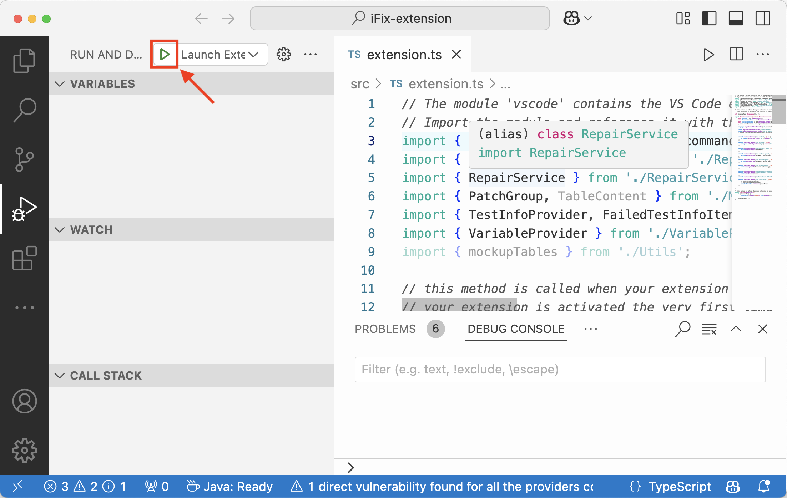
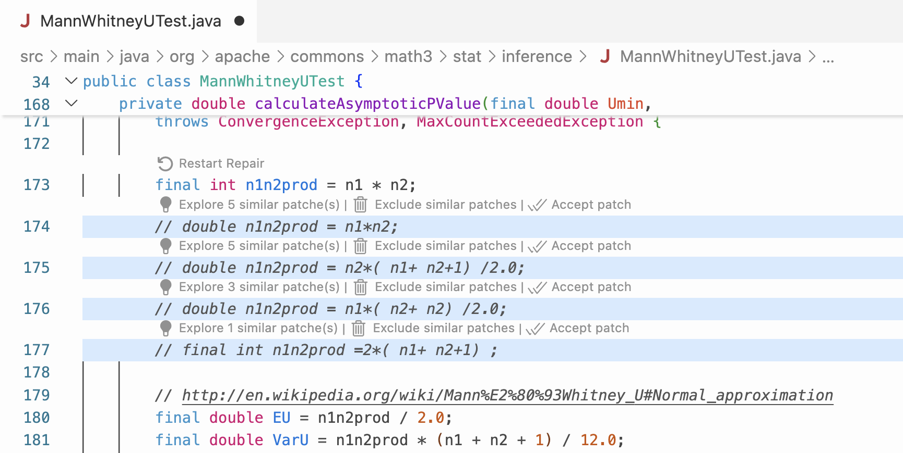
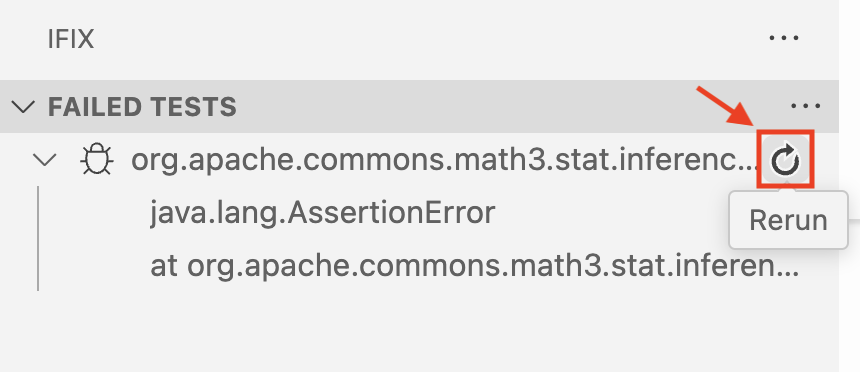
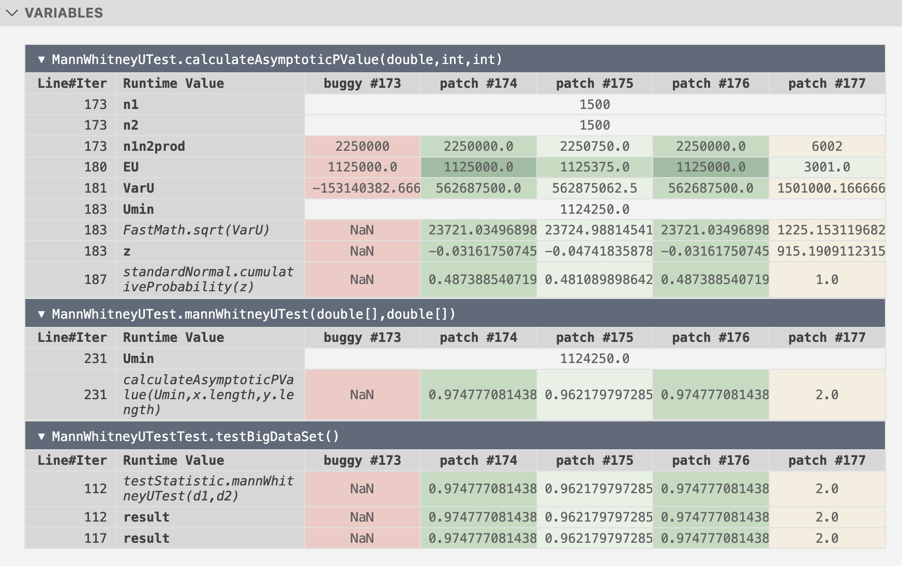

# iFix Artifact
The source code and experimental scripts of the paper accepted at OOPSLA 2025:

*Show Me Why It's Correct: Saving 1/3 of Debugging Time in Program Repair with Interactive Runtime Comparison*.

## Installation

### Recommended System Environment

The following environment configuration has been tested and verified by the authors.

 - Operating System: **macOS (Apple Silicon)**
 - Java 1.8 and 11 **(Important)**
     - Java 1.8: Azul JDK 1.8.0_352 (arm64) [[Download Page](https://www.azul.com/downloads/?version=java-8-lts&os=macos&architecture=arm-64-bit&package=jdk&show-old-builds=true#zulu)]
     - Java 11: Oracle JDK 11.0.16.1 (arm64) [[Download Page](https://www.oracle.com/java/technologies/javase/jdk11-archive-downloads.html)]
  
    For quick reproduction, the required JDKs can be installed directly using the [official installer files (.dmg)](https://zenodo.org/records/14585841).
    
    Set Java 1.8 as the default JDK:

    ```sh
    echo 'export JAVA_HOME=$(/usr/libexec/java_home -v 1.8.0_352)' >> ~/.zshrc
    source ~/.zshrc
    ```
 - Maven
    ```sh 
    brew install maven
    ```
 - Visual Studio Code **(Please update to the latest version)** [[Download](https://code.visualstudio.com/download)]
 - Node.js (npm) [[Installation](https://nodejs.org/en/download/)]
 - Yarn [[Installation](https://classic.yarnpkg.com/lang/en/docs/install/#mac-stable)]
 - Conda (Anaconda or Miniconda) [[Installation](https://docs.conda.io/projects/conda/en/stable/user-guide/install/macos.html)]

### Steps

1. Verify system dependeicies.
    ```sh
    # CPU Architecture
    uname -ms    # Should print "Darwin arm64"

    # npm
    npm -v

    # yarn
    yarn -v

    # JDK
    # Default JDK
    java -version
    # Should print the following:
    # openjdk version "1.8.0_352"
    # OpenJDK Runtime Environment (Zulu 8.66.0.15-CA-macos-aarch64) (build 1.8.0_352-b08)
    # OpenJDK 64-Bit Server VM (Zulu 8.66.0.15-CA-macos-aarch64) (build 25.352-b08, mixed mode)

    /usr/libexec/java_home -V
    # The following two lines are expected:
    # 11.0.16.1 (arm64) "Oracle Corporation" - "Java SE 11.0.16.1" /Library/Java/JavaVirtualMachines/jdk-11.0.16.1.jdk/Contents/Home
    # 1.8.0_352 (arm64) "Azul Systems, Inc." - "Zulu 8.66.0.15" /Library/Java/JavaVirtualMachines/zulu-8.jdk/Contents/Home

    # Maven
    mvn -v

    # Conda
    conda -V
    ```

2. Clone this repository

    ```sh
    git clone git@github.com:ailen-wrx/ifix.git
    ```

3. Create a Conda environment and start the iFix server. 


    ```sh
    # Run the following commands in a separate terminal and keep the process running.

    cd $PATH_TO_IFIX_REPO/iFix-server
    # create and configure conda environment
    conda create --name ifix python=3.8.15
    conda activate ifix
    pip install -r requirements.txt

    # Start iFix server
    hupper -m waitress --port=8000 ipr_server:server
    # Should print the following:
    # Starting monitor for PID 59903.
    # INFO:waitress:Serving on http://0.0.0.0:8000
    ```

4. Configure Yarn environment

    ```sh
    # Run the following commands in a separate terminal and keep the process running.

    cd $PATH_TO_IFIX_REPO/iFix-extension
    yarn
    yarn watch
    # Should print the following:
    #[time] Starting compilation in watch mode...
    #[time] Found 0 errors. Watching for file changes.
    ```

5. Compile Runtime Comparison Backend

    *This step is **NOT** necessary since the the compiled program is already provided.

      ```sh
      cd $PATH_TO_IFIX_REPO/iFix-extension/runtime-comp
      mvn clean package
      ```

## Running iFix

### Steps

1. Decompress Defects4j bugs
    ```sh
    cd $PATH_TO_IFIX_REPO
    unzip -q d4j-repo.zip
    ```

2. Open the `iFix-extension` folder in a separate VS Code window.

3. Within the window, navigate to the file `src/extension.ts`.
	
4. Press F5 or click on **Run and Debug** (refer to the figure below). This will launch a new window with iFix running.

    

5. In the new VS Code workspace, click on **File** > **New Window** to open one of the following buggy projects:
    `d4j-repo/Math_30`, 
    `d4j-repo/Lang_6`, 
    `d4j-repo/Chart_9`, or 
    `d4j-repo/Math_94`.

6. Open the buggy file in the workspace to use the functionality of iFix:

    - Math_30: `src/main/java/org/apache/commons/math3/stat/inference/MannWhitneyUTest.java`, Line 173,

    - Lang_6: `src/main/java/org/apache/commons/lang3/text/translate/CharSequenceTranslator.java`, Line 95,

    - Chart_9: `src/main/java/org/jfree/data/time/TimeSeries.java`, Line 1071,

    - Math_94: `src/java/org/apache/commons/math/util/MathUtils.java`, Line 412.

    Once the buggy file is opened, a pop-up notification will appear in the bottom-right corner: “**Repair mode is active. The file is now read-only**”: 

    
  
    The sampled patches should appear after the buggy line. The figure below is an example of the bug Math_30:

    

7. Click on the  icon on the left to open iFix. There are two panels: **FAILED TESTS** and **VARIABLES**. The **FAILED TESTS** panel displays the error message and the stack trace. Click the "rerun" button as shown in the figure below:

    

    IFix will produce the following output in the output channel:

    ```
    [IPR] Begin parallel debugging...
    [IPR] Project with buggy line has been created.
    [IPR] Project with patch No.1 has been created.
    [IPR] Project with patch No.2 has been created.
    [IPR] Project with patch No.1 has been tested.
    [IPR] Project with buggy line has been tested.
    [IPR] Project with patch No.2 has been tested.
    [IPR] Finished parallel debugging.
    child process exited with code 0
    Get table data from backend
    ```

    Once completed, the runtime comparison table will be displayed in the **VARIABLES** panel, as shown in the figure below:

    

### Demo Video

[](https://www.youtube.com/watch?v=Fvi1mIkZ9tE)

## Experimental Results

Our user study and quantitative experiments were conducted on two different hardware platforms because the quantitative experiments required GPUs. The [user study](#section-4-user-study) is based on macOS with Apple Silicon, while the [quantitative experiments](#section-5-quantitative-experiments) need to be executed on a Ubuntu server.

### Section 4: User Study

The detailed steps to run iFix with the bugs used in our study are outlined above [[Installation](#installation), [Running iFix](#running-ifix)]. To ensure accurate reproduction, please follow the recommended configurations.

For more details about the participants, protocol, and results of our study, please refer to the [user-study-data](user-study-data) directory or visit [our website](https://sites.google.com/view/ifixuserstudy).

### Section 5: Quantitative Experiments

#### Recommended System Environment
The following environment configuration has been tested and verified by the authors.

 - Operating System: **Ubuntu 20.04** (or higher)
 - GPU: Equal to or better than an NVIDIA Tesla T4
 - NVidia Driver
 - Default Java version: JDK 11 or higher
 - Conda (Anaconda or Miniconda) [[Installation](https://docs.conda.io/projects/conda/en/stable/user-guide/install/macos.html)]


#### Steps

1. Verify system dependeicies.

    ```sh
    # GPU and NVidia Driver
    nvidia-smi

    # Default JDK
    java --version
    # Should print the following (or a higher version):
    # openjdk 11.0.24 2024-07-16
    # OpenJDK Runtime Environment (build 11.0.24+8-post-Ubuntu-1ubuntu322.04)

    # Conda
    conda -V
    ```

3. Create a Conda environment. 

    ```sh
    cd $PATH_TO_IFIX_REPO/quantitative-experiments
    # create and configure conda environment
    conda create --name ifix-eval python=3.8.15
    conda activate ifix-eval
    pip install -r requirements.txt
    ```

4. Run experiments.

   ```sh
   cd $PATH_TO_IFIX_REPO/quantitative-experiments

   # unzip the binary program of GumTree
   unzip -q gumtree-3.0.0.zip

   # Run experiments
   python experiment.py --rq4 --rq5
   # Should print the following:
   # Running iFix patch clustering and sampling on CURE patches.
   # ...
   # Evaluating for RQ4: Compared with other patching ranking methods, how effective is the patch clustering and sampling algorithm in terms of the final rank of the correct patch?
   # Baseline: original ranking of CURE
   # ...
   # Baseline: static patch ranking (S3)
   # ...
   # Baseline: learning-based patch ranking (Alpharepair)
   # ...
   # Baseline: similarity-based ranking (ablation study)
   # ...
   # Evaluating for RQ5: How sensitive is the patch clustering and sampling algorithm to the underlying APR techniques?
   # Tool: RewardRepair
   # ...
   # Tool: KNOD
   # ...
   ```

5. Results.

   The ranked patches are stored in the [result](quantitative-experiments/result) directory. We manually compare these results with the ground truth to identify the ranking of the correct patch.
   
      ```sh
      quantitative-experiments/result
    ├── CURE        # Re-ranking results of CURE patches with different approaches (RQ4)
    │   ├── Chart_9
    │   │   ├── CURE_rank.java              # Original ranking of CURE
    │   │   ├── LearningBased_rank.java     # Result of learning-based patch ranking 
    │   │   │                               # (Alpharepair)
    │   │   ├── S3_rank.java                # Result of static patch ranking (S3)
    │   │   ├── SIMPLE_RANK_rank.java       # Result of similarity-based ranking 
    │   │   │                               # (ablation study)
    │   │   ├── MCR_1.java                  # Result of iFix's first round sampling
    │   │   ├── MCR_1_1.java                # Result of iFix's second round sampling
    │   │   ├── cluster_1.json              # Patch clusters of iFix's first round sampling
    │   │   └── cluster_1_1.json            # Patch clusters of iFix's second round sampling
    │   └── ...           # Other bugs
    │
    │   # Re-ranking results of patches by different APR approaches with iFix's approach (RQ5)
    ├── KNOD        
    │   ├── Chart_9
    │   │   ├── KNOD_rank.java              # Original ranking of KNOD
    │   │   ├── MCR_1.java                  # Result of iFix's first round sampling
    │   │   └── cluster_1.json              # Patch clusters of iFix's first round sampling
    │   └── ...
    └── RewardRepair
          ├── Chart_9
          │   ├── RewardRepair_rank.java      # Original ranking of RewardRepair
          │   ├── MCR_1.java                  # Result of iFix's first round sampling
          │   └── cluster_1.json              # Patch clusters of iFix's first round sampling
          └── ...
      ```

   
    Each re-ranking result file contains a list of patches. The re-ranking score is determined by manually identifying the index of the first patch that is semantically equivalent to the ground truth. For example, the file `quantitative-experiments/result/CURE/Lang_6/CURE_rank.java` contains the following list of patches:
    
    ```java
    1: pos += Character.charCount( Character.codePointAt( input , pos - pos ) ) ;
    2: pos += Character.charCount( Character.codePointAt( input ,0) ) ;
    3: pos += Character.charCount( Character.codePointAt( input , pt ) ) ;
    4: pos += Character.charCount( Character.codePointAt( input , pos &1) ) ;
    5: pos += Character.charCount( Character.codePointAt( input , pos /2) ) ;
    6: pos += Character.charCount( Character.codePointAt( input , pos /3) ) ;
    7: pos += Character.charCount( Character.codePointAt( input ,0) ) ; ;
    ```

    We identified that the 3rd patch is semantically equivalent to the [ground truth patch](https://program-repair.org/defects4j-dissection/#!/bug/Lang/6). Therefore, the score of CURE's original ranking is 3.

    A summary of all patch rankings is available in the [summary](quantitative-experiments/summary) directory.

  
